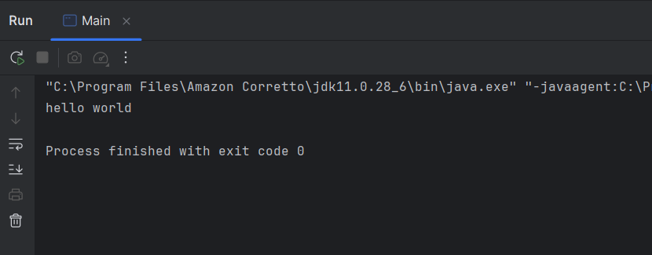

# Laporan Modul 1: Perkenalan Java dan Ekosistemnya
**Mata Kuliah:** Praktikum Pemrograman Berorientasi Objek   
**Nama:** Alif Riski Adriansyah  
**NIM:** 2024573010110  
**Kelas:** TI 2A

---

## Abstrak
Laporan ini membahas dasar teori tentang bahasa pemrograman Java, proses instalasi Java Development Kit (JDK) pada sistem operasi Windows, serta langkah-langkah pembuatan program sederhana “Hello World” menggunakan Java. Tujuan dari laporan ini adalah untuk memperkenalkan lingkungan pemrograman Java, memahami peran komponen penting seperti JDK, JRE, dan JVM, serta melatih mahasiswa membuat program pertama sebagai fondasi untuk praktikum berikutnya.

---

## 1. Pendahuluan
Java adalah bahasa pemrograman berorientasi objek (Object Oriented Programming/OOP) yang dikembangkan oleh Sun Microsystems pada tahun 1995 dan kini dikelola oleh Oracle. Java terkenal dengan prinsip “Write Once, Run Anywhere” karena program Java dikompilasi menjadi bytecode yang dapat dijalankan di berbagai platform menggunakan Java Virtual Machine (JVM).

Komponen utama dalam ekosistem Java antara lain:

JDK (Java Development Kit): berisi compiler (javac), library, dan tool untuk menulis serta mengompilasi program.

JRE (Java Runtime Environment): berisi JVM dan library inti untuk menjalankan program Java.

JVM (Java Virtual Machine): mesin virtual yang mengeksekusi bytecode sehingga program dapat berjalan lintas platform.

IDE (Integrated Development Environment): seperti IntelliJ IDEA atau Eclipse, membantu programmer menulis, mengelola, dan menjalankan program dengan lebih efisien.

Java banyak digunakan untuk pengembangan aplikasi desktop, mobile (Android), web, hingga sistem enterprise karena kestabilan, keamanan, serta ekosistem library dan framework yang luas.

---

## 2. Proses instalasi Java
- Langkah instalasi JDK pada Windows adalah sebagai berikut:

1. Download JDK dari situs resmi (misalnya Oracle JDK atau Amazon Corretto OpenJDK). Pilih versi LTS (misalnya Java 17 atau Java 21).

2. Jalankan installer: klik dua kali file .msi atau .exe yang sudah diunduh, lalu ikuti langkah instalasi. Biasanya cukup menekan tombol Next hingga selesai.

3. Atur PATH Environment Variable:

Buka Control Panel → System and Security → System.

Pilih Advanced system settings → Environment Variables.

Pada System variables, cari Path, lalu tambahkan alamat direktori bin dari JDK (contoh: C:\Program Files\Java\jdk-17\bin).

Simpan perubahan dengan menekan OK.

4. Verifikasi instalasi: buka Command Prompt, ketik java -version dan javac -version. Jika versi Java muncul, maka instalasi berhasil.

---

## 3. Laporan proses pembuatan program hello world dengan java
Setelah instalasi berhasil, buat program sederhana di Java:

1. Buat file baru dengan nama Main.java.

2. Tulis kode berikut:

public class Main {
public static void main(String[] args) {
System.out.println("Hello, World!");
}
}

3. Kompilasi program dengan perintah:

javac Main.java

Perintah ini menghasilkan file Main.class berupa bytecode.

4. Jalankan program dengan perintah:

java Main

5. Hasil output:

Hello, World!

Analisis: Program berhasil dijalankan dan menampilkan teks ke layar. Hal ini membuktikan bahwa lingkungan pengembangan Java sudah terpasang dengan benar dan mahasiswa mampu menulis program Java pertama.

---

## 4. Referensi
1. Oracle — Java Platform, Standard Edition Documentation — https://docs.oracle.com/javase/

2. W3Schools — Java Tutorial — https://www.w3schools.com/java/

3. GeeksforGeeks — Introduction to Java — https://www.geeksforgeeks.org/introduction-to-java/

4. Lab 1 -> Course Introduction & Lab Setub https://hackmd.io/@mohdrzu/ByrYifVFeg

---
