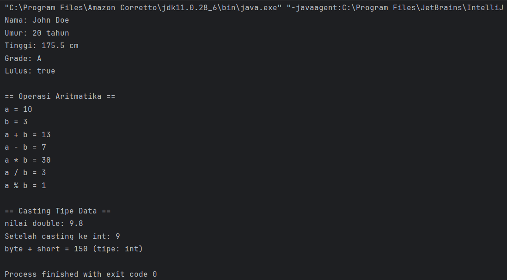
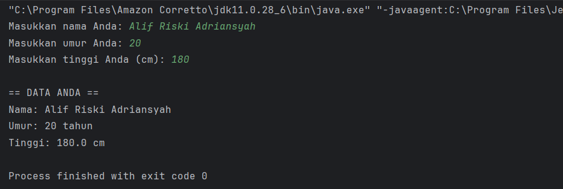
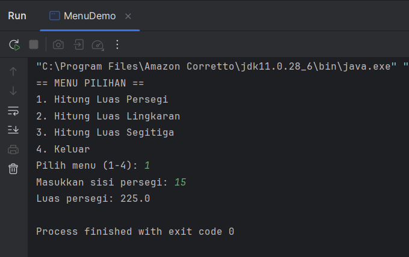
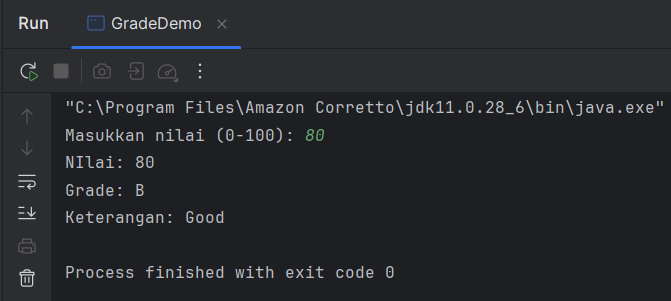
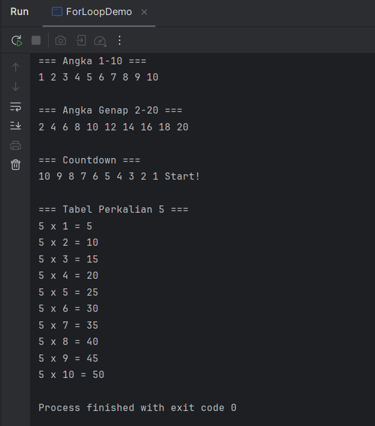
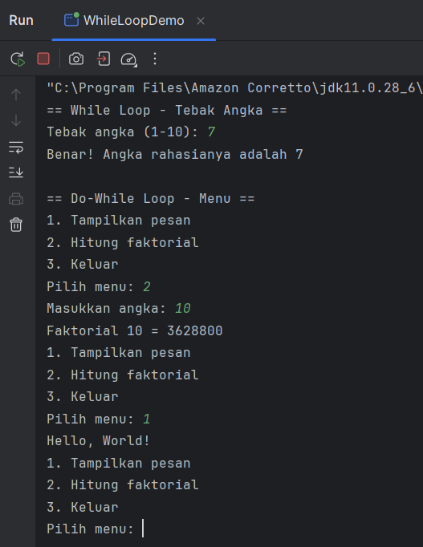
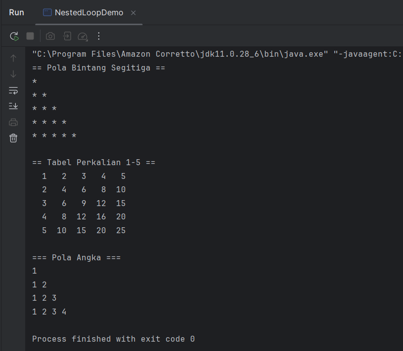
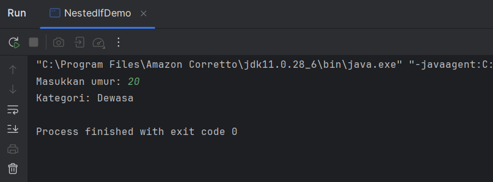

# Laporan Modul 2: Dasar Pemrograman Java
**Mata Kuliah:** Praktikum Pemrograman Berorientasi Objek   
**Nama:** Alif Riski Adriansyah  
**NIM:** 2024573010110
**Kelas:** TI 2A

---

## 1. Abstrak
Praktikum ini membahas dasar-dasar pemrograman Java yang meliputi penggunaan variabel, tipe data, input-output dengan class Scanner, serta struktur kontrol seperti percabangan dan perulangan. Melalui beberapa latihan, mahasiswa diperkenalkan dengan cara mendefinisikan variabel, menerima input dari pengguna, menampilkan output, serta menyusun logika program menggunakan if, switch, for, while, do-while, dan nested loop. Setiap praktikum disertai dengan implementasi langsung dalam bentuk program sederhana, seperti menghitung nilai, membuat menu pilihan, menampilkan pola bintang, hingga tabel perkalian.

Tujuan dari praktikum ini adalah untuk memberikan pemahaman dan keterampilan dasar dalam menulis program menggunakan bahasa Java. Mahasiswa diharapkan mampu memahami konsep variabel, tipe data, input-output, serta struktur kontrol yang menjadi fondasi dalam pemrograman. Selain itu, praktikum ini juga melatih logika pemrograman dan keterampilan problem solving melalui penyusunan kode yang sesuai dengan kebutuhan. Penyusunan laporan yang mencakup abstrak, teori, analisis, dan kesimpulan bertujuan agar mahasiswa terbiasa mendokumentasikan hasil kerja secara sistematis, sementara penggunaan GitHub membantu membiasakan mahasiswa dalam pengelolaan versi dan kolaborasi proyek perangkat lunak.

---
## 2. Praktikum
### Praktikum 1 - Variabel dan Tipe Data
#### Dasar Teori
Variabel adalah wadah untuk menyimpan data yang dapat digunakan dan diubah selama program berjalan. Java memiliki tipe data primitif (seperti int, double, char, boolean) dan tipe referensi (seperti String, Array, dan Object). Pemilihan tipe data penting agar data tersimpan dengan benar dan efisien.
#### Langkah Praktikum
Membuat program VariabelDemo.java yang mendeklarasikan variabel dengan berbagai tipe data, memberikan nilai awal, kemudian menampilkannya di layar menggunakan System.out.println().
```declarative
    package modul_2;

    public class VariabelDemo {
    public static void main(String[] args) {
    // Deklarasi dan inisialisasi variabel
    int umur = 20;
    double tinggi = 175.5;
    char grade = 'A';
    boolean lulus = true;
    String nama = "John Doe";

            // Menampilkan nilai variabel
            System.out.println("Nama: " + nama);
            System.out.println("Umur: " + umur + " tahun");
            System.out.println("Tinggi: " + tinggi + " cm");
            System.out.println("Grade: " + grade);
            System.out.println("Lulus: " + lulus);

            int a = 10;
            int b = 3;

            System.out.println("\n== Operasi Aritmatika ==");
            System.out.println("a = " + a);
            System.out.println("b = " + b);
            System.out.println("a + b = " + (a + b));
            System.out.println("a - b = " + (a - b));
            System.out.println("a * b = " + (a * b));
            System.out.println("a / b = " + (a / b));
            System.out.println("a % b = " + (a % b));

            System.out.println("\n== Casting Tipe Data ==");
            double nilaiDouble = 9.8;
            int nilaiInt = (int) nilaiDouble;

            System.out.println("nilai double: " + nilaiDouble);
            System.out.println("Setelah casting ke int: " + nilaiInt);

            // Automatic promotion
            byte byteVar = 50;
            short shortVar = 100;
            int hasil = byteVar + shortVar;
            System.out.println("byte + short = " + hasil + " (tipe: int)");
        }
    }

```
#### Screenshoot Hasil

#### Analisa dan Pembahasan
Program berhasil menampilkan nilai variabel sesuai tipe data yang digunakan. Hal ini menunjukkan bahwa setiap tipe data memiliki aturan dan batasan berbeda, misalnya angka pecahan disimpan di double, sedangkan teks di String.
### Praktikum 2 - Input, Output, dan Scanner
#### Dasar Teori
Java menggunakan class Scanner untuk membaca input dari pengguna, dengan method seperti nextInt() untuk bilangan bulat, nextDouble() untuk bilangan desimal, dan nextLine() untuk string. Output ditampilkan menggunakan System.out.println().
#### Langkah Praktikum
Membuat program InputOutputDemo.java yang meminta pengguna memasukkan data berupa angka dan teks, kemudian menampilkannya kembali di layar.
```declarative
    package modul_2;

    import java.util.Scanner;

    public class InputOutputDemo {
    public static void main(String[] args) {
    // Membuat objek Scanner
    Scanner input = new Scanner(System.in);

            // Membaca input string
            System.out.print("Masukkan nama Anda: ");
            String nama = input.nextLine();

            // Membaca input integer
            System.out.print("Masukkan umur Anda: ");
            int umur = input.nextInt();

            // Membaca input double
            System.out.print("Masukkan tinggi Anda (cm): ");
            double tinggi = input.nextDouble();

            // Menampilkan output
            System.out.println("\n== DATA ANDA ==");
            System.out.println("Nama: " + nama);
            System.out.println("Umur: " + umur + " tahun");
            System.out.println("Tinggi: " + tinggi + " cm");

            // Menutup Scanner
            input.close();
        }
    }

```
#### Screenshoot Hasil

#### Analisa dan Pembahasan
Program dapat menerima berbagai jenis input dan menampilkannya kembali tanpa error. Ini menunjukkan bahwa interaksi program dengan pengguna dapat dilakukan secara langsung melalui terminal dengan class Scanner.
### Praktikum 3 - Struktur Control: Percabangan
#### Dasar Teori
Percabangan digunakan untuk pengambilan keputusan dalam program. Bentuknya antara lain if, if-else, if-else-if, dan switch-case. Struktur ini memungkinkan program memilih jalur eksekusi berdasarkan kondisi tertentu.
#### Langkah Praktikum
Membuat program penentu grade menggunakan if-else, program menu sederhana menggunakan switch, dan program kategori umur dengan nested if.
- Program Penentu Grade
```declarative
    package modul_2;

    import java.util.Scanner;

    public class GradeDemo {
    public static void main(String[] args) {
    Scanner input = new Scanner(System.in);

    System.out.print("Masukkan nilai (0-100): ");
    int nilai = input.nextInt();

    char grade;
    String keterangan;

        // Menggunakan if-else if-else
        if (nilai > 85) {
        grade = 'A';
        keterangan = "Excellent";
        } else if (nilai > 75) {
        grade = 'B';
        keterangan = "Good";
        } else if (nilai > 65) {
        grade = 'C';
        keterangan = "Fair";
        } else if (nilai > 55) {
        grade = 'D';
        keterangan = "Poor";
        } else {
        grade = 'E';
        keterangan = "Fail";
        }

        System.out.println("NIlai: " + nilai);
        System.out.println("Grade: " + grade);
        System.out.println("Keterangan: " + keterangan);

        input.close();
        }
    }
```
- Program Menu dengan Switch
```declarative
import java.util.Scanner;

public class MenuDemo {
    public static void main(String[] args) {
        Scanner input = new Scanner(System.in);

        System.out.println("== MENU PILIHAN ==");
        System.out.println("1. Hitung Luas Persegi");
        System.out.println("2. Hitung Luas Lingkaran");
        System.out.println("3. Hitung Luas Segitiga");
        System.out.println("4. Keluar");

        System.out.print("Pilih menu (1-4): ");
        int pilihan = input.nextInt();

        switch (pilihan) {
            case 1:
                System.out.print("Masukkan sisi persegi: ");
                double sisi = input.nextDouble();
                double luasPersegi = sisi * sisi;
                System.out.println("Luas persegi: " + luasPersegi);
                break;

            case 2:
                System.out.print("Masukkan jari-jari lingkaran: ");
                double jariJari = input.nextDouble();
                double luasLingkaran = Math.PI * jariJari * jariJari;
                System.out.println("Luas lingkaran: " + luasLingkaran);
                break;

            case 3:
                System.out.print("Masukkan alas segitiga: ");
                double alas = input.nextDouble();
                System.out.print("Masukkan tinggi segitiga: ");
                double tinggi = input.nextDouble();
                double luasSegitiga = 0.5 * alas * tinggi;
                System.out.println("Luas segitiga: " + luasSegitiga);
                break;

            case 4:
                System.out.println("Terima kasih!");
                break;

            default:
                System.out.println("Pilihan tidak valid!");
        }

        input.close();
    }
}
```
#### Screenshoot Hasil
- MenuDemo

- GradeDemo

#### Analisa dan Pembahasan
Program berhasil menampilkan hasil sesuai kondisi input. Hal ini menunjukkan percabangan penting untuk membuat program lebih dinamis dan dapat menyesuaikan perilaku sesuai data yang masuk.
### Praktikum 4 - Struktur Kontrol (Perulangan)
#### Dasar Teori
Perulangan (for, while, do-while) digunakan untuk mengeksekusi perintah berulang kali selama kondisi terpenuhi. for cocok untuk jumlah perulangan yang sudah pasti, sedangkan while dan do-while lebih fleksibel untuk kondisi tertentu.
#### Langkah Praktikum
Membuat program perulangan angka 1–10, angka genap 2–20, countdown dari 10 ke 1, tabel perkalian, permainan tebak angka menggunakan while, serta menu pilihan menggunakan do-while.
- Buat file ForLoopDemo
```declarative
package modul_2;

public class ForLoopDemo {
    public static void main(String[] args) {
        // Contoh 1: Menampilkan angka 1-10
        System.out.println("=== Angka 1-10 ===");
        for (int i = 1; i <= 10; i++) {
            System.out.print(i + " ");
        }
        System.out.println();

        // Contoh 2: Menampilkan angka genap
        System.out.println("\n=== Angka Genap 2-20 ===");
        for (int i = 2; i <= 20; i += 2) {
            System.out.print(i + " ");
        }
        System.out.println();

        // Contoh 3: Countdown
        System.out.println("\n=== Countdown ===");
        for (int i = 10; i >= 1; i--) {
            System.out.print(i + " ");
        }
        System.out.println("Start!");

        // Contoh 4: Tabel perkalian
        System.out.println("\n=== Tabel Perkalian 5 ===");
        for (int i = 1; i <= 10; i++) {
            System.out.println("5 x " + i + " = " + (5 * i));
        }
    }
}
```
- Buat file WhileLoopDemo
```declarative
package modul_2;

import java.util.Scanner;

public class WhileLoopDemo {
    public static void main(String[] args) {
        Scanner input = new Scanner(System.in);

        // Contoh While Loop
        System.out.println("== While Loop - Tebak Angka ==");
        int angkaRahasia = 7;
        int tebakan = 0;

        while (tebakan != angkaRahasia) {
            System.out.print("Tebak angka (1-10): ");
            tebakan = input.nextInt();

            if (tebakan < angkaRahasia) {
                System.out.println("Terlalu kecil!");
            } else if (tebakan > angkaRahasia) {
                System.out.println("Terlalu besar!");
            } else {
                System.out.println("Benar! Angka rahasianya adalah " + angkaRahasia);
            }
        }

        // Contoh Do-While Loop
        System.out.println("\n== Do-While Loop - Menu ==");
        int pilihan;

        do {
            System.out.println("1. Tampilkan pesan");
            System.out.println("2. Hitung faktorial");
            System.out.println("3. Keluar");
            System.out.print("Pilih menu: ");
            pilihan = input.nextInt();

            switch (pilihan) {
                case 1:
                    System.out.println("Hello, World!");
                    break;
                case 2:
                    System.out.print("Masukkan angka: ");
                    int n = input.nextInt();
                    long faktorial = 1;
                    for (int i = 1; i <= n; i++) {
                        faktorial *= i;
                    }
                    System.out.println("Faktorial " + n + " = " + faktorial);
                    break;
                case 3:
                    System.out.println("Terima kasih!");
                    break;
                default:
                    System.out.println("Pilihan tidak valid!");
            }
        } while (pilihan != 3);

        input.close();
    }
}
```
#### Screenshoot Hasil
- ForLoopDemo

- WhileLoopDemo


#### Analisa dan Pembahasan
Program berjalan sesuai harapan dan menampilkan hasil perulangan dengan benar. Hal ini membuktikan perulangan mempermudah pekerjaan berulang tanpa harus menulis kode yang sama berulang kali.
### Praktikum 5 - Nested Loop
#### Dasar Teori
Nested loop adalah perulangan di dalam perulangan lain. Biasanya digunakan untuk membentuk pola dua dimensi, tabel, atau matriks. Loop luar mengatur baris, sedangkan loop dalam mengatur kolom.
#### Langkah Praktikum
Membuat program pola bintang berbentuk segitiga, tabel perkalian 1–5, serta pola angka bertingkat. Semua pola dihasilkan dengan menggunakan perulangan bersarang.
- NestedLoopDemo
```declarative
package modul_2;

public class NestedLoopDemo {
    public static void main(String[] args) {
        // Contoh 1: Pola Bintang
        System.out.println("== Pola Bintang Segitiga ==");
        for (int i = 1; i <= 5; i++) {
            for (int j = 1; j <= i; j++) {
                System.out.print("* ");
            }
            System.out.println();
        }

        // Contoh 2: Tabel Perkalian
        System.out.println("\n== Tabel Perkalian 1-5 ==");
        for (int i = 1; i <= 5; i++) {
            for (int j = 1; j <= 5; j++) {
                System.out.printf("%3d ", (i * j));
            }
            System.out.println();
        }

        // Contoh 3: Pola Angka
        System.out.println("\n=== Pola Angka ===");
        for (int i = 1; i <= 4; i++) {
            for (int j = 1; j <= i; j++) {
                System.out.print(j + " ");
            }
            System.out.println();
        }
    }
}
```
- NestedIfDemo
```declarative
package modul_2;

import java.util.Scanner;

public class NestedIfDemo {
    public static void main(String[] args) {
        Scanner input = new Scanner(System.in);

        System.out.print("Masukkan umur: ");
        int umur = input.nextInt();

        if (umur >= 0) {
            if (umur < 2) {
                System.out.println("Kategori: Bayi");
            } else if (umur < 5) {
                System.out.println("Kategori: Balita");
            } else if (umur < 12) {
                System.out.println("Kategori: Anak-anak");
            } else if (umur < 19) {
                System.out.println("Kategori: Remaja");
            } else if (umur < 59) {
                System.out.println("Kategori: Dewasa");
            } else {
                System.out.println("Kategori: Lansia");
            }
        } else {
            System.out.println("Umur tidak valid!");
        }

        input.close();
    }
}
```
#### Screenshoot Hasil
- NestedLoopDemo
  
- NestedIfDemo
  
#### Analisa dan Pembahasan
Program menghasilkan pola sesuai yang diinginkan. Nested loop terbukti sangat berguna dalam membentuk pola yang lebih kompleks, khususnya yang melibatkan baris dan kolom secara bersamaan.

---
## 3. Kesimpulan

Melalui praktikum dasar pemrograman Java ini, mahasiswa telah mempelajari konsep-konsep fundamental yang menjadi pondasi dalam pengembangan perangkat lunak berbasis objek. Materi mencakup penggunaan variabel dan tipe data untuk menyimpan informasi, pemanfaatan class Scanner dalam menerima input dari pengguna, serta penerapan struktur kontrol seperti percabangan dan perulangan untuk mengatur alur logika program. Setiap latihan yang dilakukan memberikan pemahaman praktis tentang bagaimana logika dan sintaks Java bekerja dalam menyelesaikan berbagai permasalahan sederhana, mulai dari operasi aritmatika, pemilihan kondisi, hingga pembentukan pola menggunakan loop bersarang. Dengan memahami konsep-konsep ini, mahasiswa diharapkan mampu menulis program yang terstruktur, efisien, dan mudah dikembangkan. Selain itu, dokumentasi hasil praktikum melalui laporan dan penggunaan GitHub membantu membiasakan mahasiswa dalam pengelolaan proyek dan pembiasaan praktik profesional di dunia pemrograman.

---

## 4. Referensi
- Oracle. (2024). The Java™ Tutorials – Learning the Java Language: Variables, Operators, and Control Flow.
https://docs.oracle.com/javase/tutorial/java/nutsandbolts/index.html

- W3Schools. (2024). Java Tutorial – Variables, Input, If Else, Loops.
https://www.w3schools.com/java/

- Deitel, P. J., & Deitel, H. M. (2017). Java: How to Program (11th Edition). Pearson Education.

- GeeksforGeeks. (2024). Java Programming Basics – Variables, Data Types, and Control Statements.
https://www.geeksforgeeks.org/java/

- Kurose, J. (2023). Pemrograman Dasar Java untuk Pemula. E-Book Universitas Terbuka.

---
