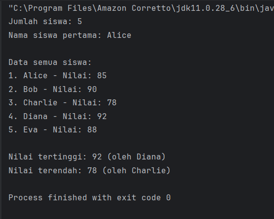
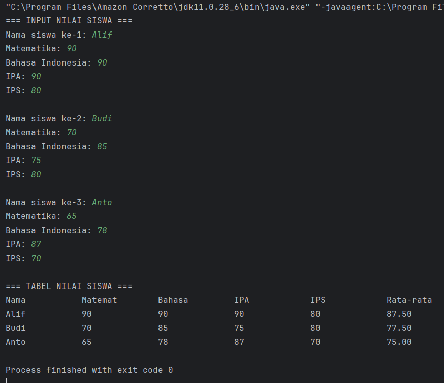
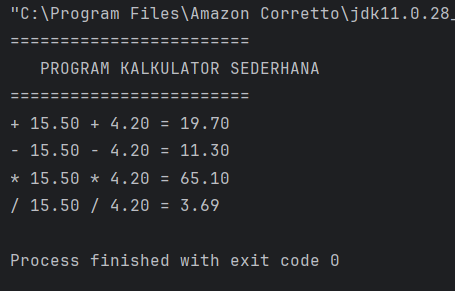
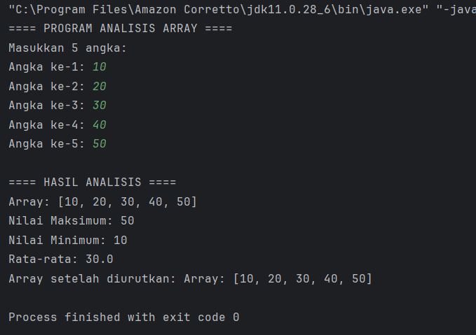
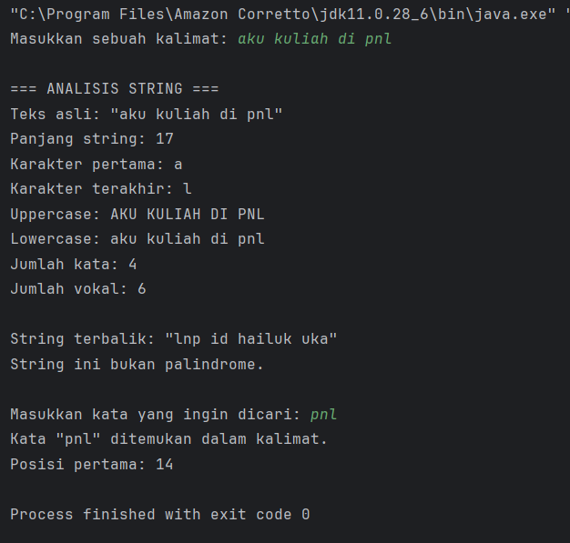
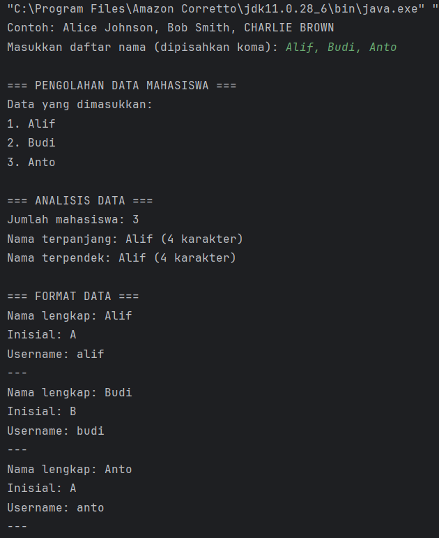

# Laporan Modul 3: Dasar Pemrograman Java Lanjutan
**Mata Kuliah:** Praktikum Pemrograman Berorientasi Objek   
**Nama:** Alif Riski Adriansyah  
**NIM:** 2024573010110
**Kelas:** TI 2A

---

## 1. Abstrak
Modul ini membahas tentang penerapan dasar-dasar pemrograman Java yang meliputi penggunaan array, method (fungsi), dan string. Tujuan utama dari praktikum ini adalah agar mahasiswa mampu memahami dan mengimplementasikan struktur data array satu dan dua dimensi, menggunakan method untuk membangun program yang modular, serta melakukan manipulasi string untuk pengolahan data teks. Melalui serangkaian latihan dan praktikum, mahasiswa diharapkan dapat menguasai konsep-konsep tersebut dan mampu menerapkannya dalam berbagai situasi pemrograman nyata. Praktikum dilakukan menggunakan bahasa Java di dalam lingkungan pengembangan (IDE) dengan membuat beberapa file program sesuai petunjuk modul.


---
## 2. Praktikum
#### Dasar Teori
Array merupakan struktur data yang digunakan untuk menyimpan sejumlah elemen yang memiliki tipe data sama. Elemen-elemen dalam array diakses melalui indeks yang dimulai dari nol. Keuntungan penggunaan array adalah kemampuannya menyimpan banyak data dalam satu variabel dan memberikan akses langsung terhadap setiap elemen. Namun, kekurangannya adalah ukuran array bersifat tetap setelah dideklarasikan.

Method dalam Java adalah blok kode yang digunakan untuk menjalankan tugas tertentu. Method digunakan untuk menghindari pengulangan kode, membuat program lebih terstruktur, serta mempermudah proses debugging dan pemeliharaan. Terdapat berbagai jenis method, di antaranya static method yang dapat dipanggil tanpa membuat objek, dan non-static method yang memerlukan objek untuk dipanggil. Method dapat bersifat void (tidak mengembalikan nilai) atau return (mengembalikan nilai tertentu).

String merupakan tipe data yang digunakan untuk menyimpan dan memanipulasi teks. Di Java, string merupakan objek dari kelas String dan bersifat immutable, artinya nilainya tidak dapat diubah setelah dibuat. Java menyediakan banyak method bawaan seperti length(), charAt(), substring(), toLowerCase(), toUpperCase(), contains(), dan replace() untuk mempermudah manipulasi teks. Pemahaman terhadap string sangat penting dalam pemrosesan data, validasi input, serta pembuatan tampilan yang interaktif di dalam program.

#### Langkah Praktikum
1. Pada praktikum pertama, mahasiswa mempelajari cara mendeklarasikan, menginisialisasi, dan mengakses elemen-elemen array satu dimensi. Program yang dibuat bertujuan menampilkan seluruh elemen array serta menambahkan fitur untuk mencari nilai tertinggi dan nilai terendah. Setelah dijalankan, program berhasil menampilkan nilai-nilai dalam array secara berurutan serta mampu menentukan nilai maksimum dan minimum dengan tepat. Analisa dari percobaan ini menunjukkan bahwa array satu dimensi sangat efektif untuk menyimpan dan memproses data linear, seperti daftar nilai atau data statistik sederhana. Pembahasan menunjukkan bahwa konsep pengulangan (looping) menjadi kunci utama dalam mengakses setiap elemen array, sementara pemahaman indeks sangat penting agar tidak terjadi kesalahan pengambilan data.
```declarative
/// Kode Program Sebelum Dimodifikasi:

        package modul_3;
public class ArraySatuDimensi {
    public static void main(String[] args) {
        // Langkah 1: Deklarasi dan inisialisasi array
        int[] nilai = {85, 90, 78, 92, 88};
        String[] nama = {"Alice", "Bob", "Charlie", "Diana", "Eva"};

        // Langkah 2: Menampilkan panjang array
        System.out.println("Jumlah siswa: " + nilai.length);

        // Langkah 3: Mengakses elemen array
        System.out.println("Nama siswa pertama: " + nama[0]);

        // Langkah 4: Menampilkan semua data menggunakan loop
        System.out.println("\nData semua siswa:");
        for (int i = 0; i < nama.length; i++) {
            System.out.println((i + 1) + ". " + nama[i] + " - Nilai: " + nilai[i]);
        }

        /// Kode Program Setelah Dimodifikasi (Mencari Nilai Ekstrem):

        // Langkah 5: Mencari nilai tertinggi dan terendah
        int nilaiTertinggi = nilai[0];
        int nilaiTerendah = nilai[0];
        String siswaTertinggi = nama[0];
        String siswaTerendah = nama[0];

        for (int i = 1; i < nilai.length; i++) {
            if (nilai[i] > nilaiTertinggi) {
                nilaiTertinggi = nilai[i];
                siswaTertinggi = nama[i];
            }
            if (nilai[i] < nilaiTerendah) {
                nilaiTerendah = nilai[i];
                siswaTerendah = nama[i];
            }
        }

        // Langkah 6: Menampilkan hasil pencarian
        System.out.println("\nNilai tertinggi: " + nilaiTertinggi + " (oleh " + siswaTertinggi + ")");
        System.out.println("Nilai terendah: " + nilaiTerendah + " (oleh " + siswaTerendah + ")");
    }
}
```
#### Screenshoot Hasil

#### Analisa dan Pembahasan
Dari hasil pelaksanaan praktikum, diperoleh pemahaman bahwa array satu dimensi sangat berguna untuk menyimpan sejumlah data dengan tipe yang sama dalam satu variabel. Melalui indeks, elemen array dapat diakses secara langsung dan efisien. Implementasi fitur pencarian nilai tertinggi dan terendah menunjukkan bahwa array memungkinkan manipulasi data numerik dengan mudah menggunakan perulangan. Selain itu, konsep indeks menjadi hal yang krusial, karena kesalahan dalam penentuan indeks dapat menyebabkan error seperti ArrayIndexOutOfBoundsException.

2. Pada praktikum ini, dibuat file ArrayDuaDimensi.java untuk memahami konsep array dua dimensi yang menyerupai struktur matriks. Program dibuat dengan mendeklarasikan dan menginisialisasi array dua dimensi, kemudian dilakukan proses input dan output data untuk mengisi serta menampilkan nilai-nilai pada baris dan kolom tertentu. Setelah itu, program dijalankan dengan beberapa variasi nilai input untuk melihat bagaimana data tersimpan dalam bentuk tabel dua dimensi.
```declarative
package modul_3;

import java.util.Scanner;

public class ArrayDuaDimensi {
    public static void main(String[] args) {
        Scanner input = new Scanner(System.in);
        // Langkah 1: Deklarasi array 2D untuk nilai siswa (3 siswa, 4 mata pelajaran)
        int[][] nilaiSiswa = new int[3][4];
        String[] namaSiswa = new String[3];
        String[] mataPelajaran = {"Matematika", "Bahasa Indonesia", "IPA", "IPS"};
        
        // Langkah 2: Input nilai
        System.out.println("=== INPUT NILAI SISWA ===");
        for (int i = 0; i < 3; i++) {
            System.out.print("Nama siswa ke-" + (i + 1) + ": ");
            namaSiswa[i] = input.next();
            for (int j = 0; j < 4; j++) {
                System.out.print(mataPelajaran[j] + ": ");
                nilaiSiswa[i][j] = input.nextInt();
            }
            System.out.println();
        }
        
        // Langkah 3: Menampilkan data dalam bentuk tabel
        System.out.println("=== TABEL NILAI SISWA ===");
        System.out.printf("%-15s", "Nama");
        for (int i = 0; i < 4; i++) {
            // Mengambil 7 karakter pertama untuk header kolom
            System.out.printf("%-15s", mataPelajaran[i].substring(0, Math.min(7, mataPelajaran[i].length())));
        }
        System.out.printf("%-15s\n", "Rata-rata");
        
        for (int i = 0; i < 3; i++) {
            System.out.printf("%-15s", namaSiswa[i]);
            int total = 0;
            for (int j = 0; j < 4; j++) {
                System.out.printf("%-15d", nilaiSiswa[i][j]);
                total += nilaiSiswa[i][j];
            }
            double ratarata = total / 4.0;
            System.out.printf("%-15.2f\n", ratarata);
        }
    }
}
```
#### Screenshoot Hasil

#### Analisa dan Pembahasan
Melalui percobaan ini, mahasiswa dapat memahami bahwa array dua dimensi sangat berguna dalam merepresentasikan data tabular seperti nilai siswa atau data matriks matematika. Setiap elemen diakses menggunakan dua indeks, yaitu indeks baris dan kolom. Penggunaan array dua dimensi membuat pengolahan data menjadi lebih terstruktur dan rapi. Dari hasil uji coba, terlihat bahwa logika perulangan bersarang (nested loop) berperan penting dalam pengolahan data dua dimensi. Pemahaman yang baik terhadap konsep ini menjadi dasar untuk operasi matriks dan pengolahan data kompleks di tahap pemrograman berikutnya.

3. Langkah awal praktikum ini adalah membuat file MethodDasar.java untuk mempelajari cara mendefinisikan dan memanggil method dalam Java. Beberapa jenis method dibuat, seperti method tanpa parameter, method dengan parameter, method dengan nilai kembali (return), serta method tanpa nilai kembali (void). Setelah program selesai diketik, dilakukan pengujian dengan mengubah nilai parameter agar mahasiswa dapat mengamati bagaimana perubahan input memengaruhi hasil yang dikembalikan oleh method.
```declarative
package modul_3;

public class MethodDasar {

    // Langkah 1: Method void tanpa parameter
    public static void tampilkanHeader() {
        System.out.println("========================");
        System.out.println("   PROGRAM KALKULATOR SEDERHANA   ");
        System.out.println("========================");
    }

    // Langkah 2: Method void dengan parameter
    public static void tampilkanHasil(String operasi, double a, double b, double hasil) {
        System.out.printf("%s %.2f %s %.2f = %.2f%n", operasi, a, operasi, b, hasil);
    }

    // Langkah 3: Method dengan return value
    public static double tambah(double a, double b) {
        return a + b;
    }

    public static double kurang(double a, double b) {
        return a - b;
    }

    public static double kali(double a, double b) {
        return a * b;
    }

    public static double bagi(double a, double b) {
        if (b != 0) {
            return a / b;
        } else {
            System.out.println("Error: Pembagian dengan nol!");
            return 0;
        }
    }

    // Langkah 4: Method dengan validasi input
    public static boolean validasiAngka(double angka) {
        return !Double.isNaN(angka) && !Double.isInfinite(angka);
    }

    // Langkah 5: Menggunakan semua method
    public static void main(String[] args) {
        tampilkanHeader();

        double x = 15.5;
        double y = 4.2;

        if (validasiAngka(x) && validasiAngka(y)) {
            double hasilTambah = tambah(x, y);
            double hasilKurang = kurang(x, y);
            double hasilKali = kali(x, y);
            double hasilBagi = bagi(x, y);

            tampilkanHasil("+", x, y, hasilTambah);
            tampilkanHasil("-", x, y, hasilKurang);
            tampilkanHasil("*", x, y, hasilKali);
            tampilkanHasil("/", x, y, hasilBagi);
        }
    }
}


```
#### Screenshoot Hasil

#### Analisa dan Pembahasan
Praktikum ini memperlihatkan bahwa method memiliki peran penting dalam membuat program menjadi lebih modular, efisien, dan mudah dipahami. Dengan adanya method, kode yang berulang dapat dihindari dan logika program dapat dipecah menjadi bagian-bagian kecil yang lebih spesifik. Selain itu, penggunaan parameter memungkinkan fleksibilitas program dalam menerima berbagai nilai masukan. Mahasiswa juga memahami perbedaan antara method void yang hanya menjalankan instruksi dan method dengan return type yang mengembalikan hasil untuk digunakan kembali dalam perhitungan atau proses lainnya.

4. Dalam praktikum ini, dibuat file ArrayMethod.java untuk memahami penerapan method yang beroperasi pada array. Program dibuat untuk memproses data array menggunakan beberapa method yang memiliki tanggung jawab berbeda, seperti menghitung rata-rata nilai, mencari elemen tertentu, dan menampilkan isi array. Setelah itu, program dijalankan dengan berbagai input untuk mengamati bagaimana setiap method bekerja sesuai fungsinya.
```declarative
package modul_3;

import java.util.Scanner;

public class ArrayMethod {

    // Method untuk input array
    public static int[] inputArray(int ukuran) {
        Scanner input = new Scanner(System.in);
        int[] array = new int[ukuran];
        System.out.println("Masukkan " + ukuran + " angka:");
        for (int i = 0; i < ukuran; i++) {
            System.out.print("Angka ke-" + (i + 1) + ": ");
            array[i] = input.nextInt();
        }
        return array;
    }

    // Method untuk menampilkan array
    public static void tampilkanArray(int[] array) {
        System.out.print("Array: [");
        for (int i = 0; i < array.length; i++) {
            System.out.print(array[i]);
            if (i < array.length - 1)
                System.out.print(", ");
        }
        System.out.println("]");
    }

    // Method untuk mencari nilai maksimum (Dikonstruksi berdasarkan potongan dan fungsi)
    public static int cariMaksimum(int[] array) {
        int maks = array[0];
        for (int i = 1; i < array.length; i++) {
            if (array[i] > maks) {
                maks = array[i];
            }
        }
        return maks;
    }
    
    // Method untuk mencari nilai minimum (Dikonstruksi berdasarkan deskripsi praktikum)
    public static int cariMinimum(int[] array) { 
        int min = array[0];
        for (int i = 1; i < array.length; i++) {
            if (array[i] < min) {
                min = array[i];
            }
        }
        return min; 
    }

    // Method untuk menghitung rata-rata (Dikonstruksi berdasarkan potongan)
    public static double hitungRataRata(int[] array) {
        int total = 0;
        for (int nilai : array) {
            total += nilai;
        }
        return (double) total / array.length;
    }

    // Method untuk mengurutkan array (Bubble Sort)
    public static int[] urutkanArray(int[] array) {
        int[] arrayBaru = array.clone(); // Membuat copy array
        for (int i = 0; i < arrayBaru.length - 1; i++) {
            for (int j = 0; j < arrayBaru.length - 1 - i; j++) {
                if (arrayBaru[j] > arrayBaru[j + 1]) {
                    // Tukar posisi
                    int temp = arrayBaru[j];
                    arrayBaru[j] = arrayBaru[j + 1];
                    arrayBaru[j + 1] = temp;
                }
            }
        }
        return arrayBaru;
    }

    public static void main(String[] args) {
        System.out.println("==== PROGRAM ANALISIS ARRAY ====");
        int[] data = inputArray(5);
        
        System.out.println("\n==== HASIL ANALISIS ====");
        tampilkanArray(data);
        System.out.println("Nilai Maksimum: " + cariMaksimum(data));
        System.out.println("Nilai Minimum: " + cariMinimum(data));
        System.out.println("Rata-rata: " + hitungRataRata(data));
        
        int[] dataTerurut = urutkanArray(data);
        System.out.print("Array setelah diurutkan: ");
        tampilkanArray(dataTerurut);
    }
}
```
#### Screenshoot Hasil

#### Analisa dan Pembahasan
Dari hasil percobaan, dapat disimpulkan bahwa penggunaan method dalam pengolahan array memberikan struktur yang lebih baik dan memudahkan pengelolaan data dalam program. Setiap method memiliki tugas khusus, seperti menghitung nilai rata-rata atau mencari elemen tertentu dalam array. Hal ini tidak hanya meningkatkan keterbacaan program tetapi juga mempermudah proses debugging. Dengan menggabungkan konsep array dan method, mahasiswa memperoleh gambaran nyata tentang bagaimana data dapat diproses secara sistematis dan efisien menggunakan pemrograman modular.

5. Pada praktikum ini, file StringDasar.java dibuat untuk mempelajari berbagai operasi manipulasi string. Program ditulis untuk mengimplementasikan beberapa method bawaan dari class String, seperti length(), charAt(), substring(), toUpperCase(), toLowerCase(), dan replace(). Program kemudian dijalankan dengan berbagai input teks untuk melihat bagaimana masing-masing method memanipulasi string, termasuk pengujian terhadap kata-kata palindrome seperti “Kasur rusak” atau “Madam”.
```declarative
package modul_3;

import java.util.Scanner;

public class StringDasar {

    public static void analisisString(String teks) {
        System.out.println("\n=== ANALISIS STRING ===");
        System.out.println("Teks asli: \"" + teks + "\"");
        System.out.println("Panjang string: " + teks.length());
        System.out.println("Karakter pertama: " + teks.charAt(0));
        System.out.println("Karakter terakhir: " + teks.charAt(teks.length() - 1));
        System.out.println("Uppercase: " + teks.toUpperCase());
        System.out.println("Lowercase: " + teks.toLowerCase());

        // Menghitung jumlah kata
        String[] kata = teks.trim().split("\\s+");
        System.out.println("Jumlah kata: " + kata.length);

        // Menghitung jumlah vokal
        int jumlahVokal = hitungVokal(teks);
        System.out.println("Jumlah vokal: " + jumlahVokal);
        // Method hitungKonsonan() seharusnya dipanggil di sini juga
    }

    public static int hitungVokal(String teks) {
        String vokal = "aeiouAEIOU";
        int count = 0;
        for (int i = 0; i < teks.length(); i++) {
            // Logika disimpulkan dari fungsionalitas
            if (vokal.contains(String.valueOf(teks.charAt(i)))) {
                count++;
            }
        }
        return count;
    }

    // Method untuk membalik string (Dikonstruksi)
    public static String reverseString(String teks) {
        return new StringBuilder(teks).reverse().toString();
    }

    // Method untuk cek palindrome (Dikonstruksi)
    public static boolean isPalindrome(String teks) {
        // Membersihkan string dari spasi/simbol dan mengubah ke lowercase untuk perbandingan
        String cleanTeks = teks.replaceAll("[^a-zA-Z0-9]", "").toLowerCase();
        String reversed = new StringBuilder(cleanTeks).reverse().toString();
        return cleanTeks.equals(reversed);
    }

    public static void main(String[] args) {
        Scanner input = new Scanner(System.in);
        System.out.print("Masukkan sebuah kalimat: ");
        String kalimat = input.nextLine();

        // Analisis dasar
        analisisString(kalimat);

        // String terbalik
        System.out.println("\nString terbalik: \"" + reverseString(kalimat) + "\"");

        // Cek palindrome
        if (isPalindrome(kalimat)) {
            System.out.println("String ini adalah palindrome!");
        } else {
            System.out.println("String ini bukan palindrome.");
        }

        // Pencarian substring
        System.out.print("\nMasukkan kata yang ingin dicari: ");
        String cari = input.nextLine();

        if (kalimat.toLowerCase().contains(cari.toLowerCase())) {
            System.out.println("Kata \"" + cari + "\" ditemukan dalam kalimat.");
            int posisi = kalimat.toLowerCase().indexOf(cari.toLowerCase());
            System.out.println("Posisi pertama: " + posisi);
        } else {
            System.out.println("Kata \"" + cari + "\" tidak ditemukan dalam kalimat.");
        }
    }
}
```
#### Screenshoot Hasil

#### Analisa dan Pembahasan
Melalui percobaan ini, mahasiswa memahami bahwa string di Java bersifat immutable, artinya setiap perubahan string menghasilkan objek baru. Method bawaan pada class String memungkinkan berbagai operasi manipulasi teks dilakukan dengan mudah. Hasil pengujian menunjukkan bahwa Java menyediakan fungsi yang sangat lengkap untuk pemrosesan data berbasis teks. Mahasiswa juga belajar pentingnya mengenali perbedaan antara perbandingan string menggunakan operator == dan method equals(), yang sering kali menjadi sumber kesalahan bagi pemrogram pemula.

6. Langkah pertama praktikum ini adalah membuat file TextProcessing.java untuk mempelajari bagaimana string digunakan dalam pengolahan data berbasis teks. Program dibuat untuk membaca nama atau data teks tertentu, lalu memproses dan memformatnya sesuai kebutuhan. Setelah itu, program diuji dengan berbagai variasi input untuk melihat hasil transformasi teks yang dihasilkan.
```declarative
package modul_3;

import java.util.Scanner;

public class TextProcessing {

    public static void prosesDataMahasiswa(String data) {
        System.out.println("\n=== PENGOLAHAN DATA MAHASISWA ===");
        // Memisahkan data berdasarkan koma
        String[] dataMahasiswa = data.split(",");

        System.out.println("Data yang dimasukkan:");
        for (int i = 0; i < dataMahasiswa.length; i++) {
            dataMahasiswa[i] = dataMahasiswa[i].trim(); // Menghilangkan spasi
            System.out.println((i + 1) + ". " + dataMahasiswa[i]);
        }

        // Analisis data
        System.out.println("\n=== ANALISIS DATA ===");
        System.out.println("Jumlah mahasiswa: " + dataMahasiswa.length);

        // Mencari nama terpanjang dan terpendek
        String namaTerpanjang = dataMahasiswa[0];
        String namaTerpendek = dataMahasiswa[0];

        for (String nama : dataMahasiswa) {
            if (nama.length() > namaTerpanjang.length()) {
                namaTerpanjang = nama;
            }
            if (nama.length() < namaTerpendek.length()) {
                namaTerpendek = nama;
            }
        }
        // Output Analisis (Dikonstruksi berdasarkan hasil screenshot)
        System.out.println("Nama terpanjang: " + namaTerpanjang + " (" + namaTerpanjang.length() + " karakter)");
        System.out.println("Nama terpendek: " + namaTerpendek + " (" + namaTerpendek.length() + " karakter)");

        System.out.println("\n=== FORMAT DATA ===");
        for (String nama : dataMahasiswa) {
            String namaFormatted = formatTitleCase(nama);
            String inisial = buatInisial(namaFormatted);

            System.out.println("Nama lengkap: " + namaFormatted);
            System.out.println("Inisial: " + inisial);
            System.out.println("Username: " + buatUsername(namaFormatted));
            System.out.println("---");
        }
    }

    public static String formatTitleCase(String teks) {
        String[] kata = teks.toLowerCase().split(" ");
        StringBuilder result = new StringBuilder();

        for (String k : kata) {
            if (k.length() > 0) {
                result.append(Character.toUpperCase(k.charAt(0)))
                        .append(k.substring(1))
                        .append(" ");
            }
        }
        return result.toString().trim();
    }

    public static String buatInisial(String nama) {
        String[] kata = nama.split(" ");
        StringBuilder inisial = new StringBuilder();

        for (String k : kata) {
            if (k.length() > 0) {
                inisial.append(Character.toUpperCase(k.charAt(0)));
            }
        }
        return inisial.toString();
    }

    // Method untuk membuat username (Dikonstruksi berdasarkan hasil screenshot)
    public static String buatUsername(String nama) {
        // Mengambil kata pertama dan mengubahnya menjadi huruf kecil
        String[] kata = nama.split(" ");
        return kata[0].toLowerCase();
    }

    public static void main(String[] args) {
        Scanner input = new Scanner(System.in);
        System.out.println("Contoh: Alice Johnson, Bob Smith, CHARLIE BROWN");
        System.out.print("Masukkan daftar nama (dipisahkan koma): ");
        String dataInput = input.nextLine();
        prosesDataMahasiswa(dataInput);
    }
}
```
#### Screenshoot Hasil

#### Analisa dan Pembahasan
Dari hasil percobaan, mahasiswa memahami bahwa string memiliki peran besar dalam berbagai aplikasi dunia nyata, seperti pembuatan laporan, format data, dan validasi input. Program yang dibuat menunjukkan bagaimana data teks dapat diproses menjadi bentuk yang lebih terstruktur dan mudah dibaca. Proses ini juga menekankan pentingnya pemahaman terhadap fungsi-fungsi string seperti pemisahan kata (split()), penggabungan teks (concat()), dan pemeriksaan karakter tertentu (contains()). Melalui praktikum ini, mahasiswa semakin memahami bahwa manipulasi string adalah fondasi penting dalam pengembangan aplikasi Java modern.

---
## 3. Kesimpulan
Dari seluruh rangkaian praktikum, dapat disimpulkan bahwa array, method, dan string merupakan konsep fundamental dalam pemrograman Java yang saling berkaitan. Array digunakan untuk menyimpan data dalam jumlah banyak secara efisien, method digunakan untuk membagi program menjadi bagian-bagian modular, dan string digunakan untuk memproses serta memanipulasi teks. Penguasaan terhadap ketiga konsep ini menjadi dasar penting untuk memahami pemrograman berorientasi objek yang lebih kompleks di tahap selanjutnya. Melalui praktikum langsung, mahasiswa tidak hanya memahami teori, tetapi juga mampu mengimplementasikannya secara nyata dalam bentuk program Java yang terstruktur dan efisien.

---

## 4. Referensi
- Oracle Documentation – The Java™ Tutorials: Arrays and Methods.

- Deitel & Deitel. (2017). Java How to Program (11th Edition). Pearson Education.

- Modul Praktikum Dasar Pemrograman Java Lanjutan – Politeknik Negeri.

- W3Schools Java Tutorial: https://www.w3schools.com/java/

---
